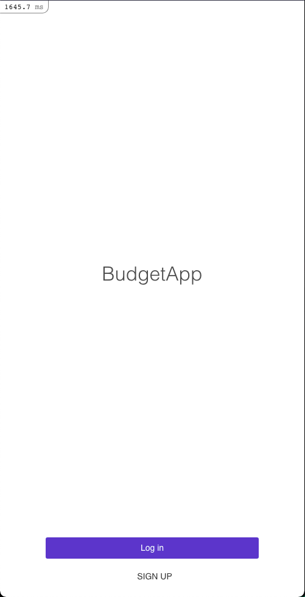

# Budget App

> Mobile budget web app



<br>
A simple budget app built using the Ruby on Rails framework.

- Presentation Video: [HERE](https://drive.google.com/file/d/15KyDFOMj3OX9N7G3H1LnaGzkCrggODy2/view?usp=sharing)

- Live Demo: [HERE](https://murmuring-reef-55251.herokuapp.com/)

## Built With

- Ruby on Rails
- PostgreSQL
- Bulma CSS

## Getting Started

To get a local copy up and running follow these simple example steps.

### Prerequisites

Setup Ruby and Ruby on Rails on your computer.

- [Ruby](https://www.ruby-lang.org/en/)
- [Rails](https://gorails.com/)

### Setup

- Make sure you have Ruby on Rails set up properly on your computer
- Clone or download this repo on your machine by running the following command:

```sh
git clone https://github.com/mmatongo/budget-app.git
```

- Enter project directory

### Development Database

```sh
# Create user
sudo -u postgres createuser budget-app -s
```

```sh
# install gems and npm packages
bundle install
```

```sh
# this will drop the database, create it, and load the schema and run the seed data
rake db:reset
```

### Install

```sh
bundle install
```

### Run

```sh
rails s
```

### Test

```sh
rake rspec
```

#### IF TESTS FAIL

```sh
RAILS_ENV=test rake db:reset
```

## Author

👤 **Daniel M. Matongo**

- GitHub: [@mmatongo](https://github.com/mmatongo)
- LinkedIn: [Daniel M. matongo](https://linkedin.com/in/mmatongo)

## 🤝 Contributing

Contributions, issues, and feature requests are welcome!
Feel free to check the [issues page](../../issues/).

## Show your support

Give a ⭐️ if you like this project!

## Acknowledgments

- Microverse
- Original design idea by Gregoire Vella on [Behance](https://www.behance.net/gregoirevella).

## License

[MIT](./LICENSE)
